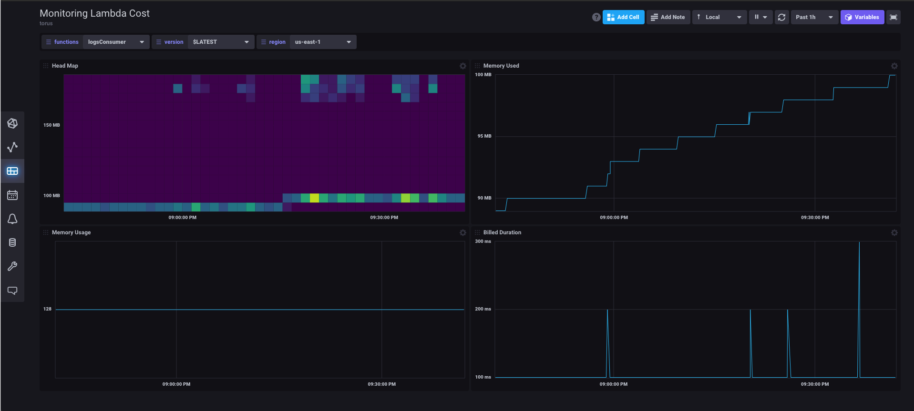

# LAMBDA-MONITORING-COST

Experiment to create a module to extract relevant metrics (Duration, Billed Duration and Memory Size) from “REPORT” log entry reported through CloudWatch and store them into InfluxDB 2.

## Dashboard example

